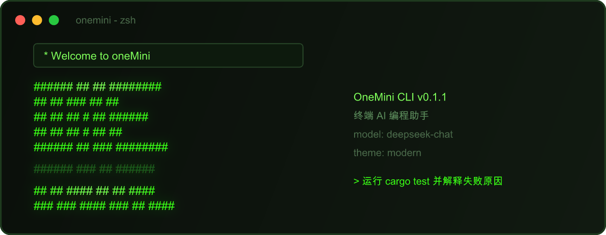

# OneMini CLI

<p align="center">
  
</p>

**终端 AI 编程助手** — 在同一轮会话里读写代码、搜索仓库、执行命令、调试与重构，并保持多轮上下文。

## 安装

| 方式 | 命令 |
|------|------|
| 一键安装（推荐） | `curl -fL --progress-bar https://raw.githubusercontent.com/AJI1026/OneMini-CLI/main/scripts/install.sh \| bash` |
| 国内镜像 | `ONEMINI_MIRROR=https://ghproxy.com curl ...` |
| Cargo 源码 | `cargo install --path .` |
| Windows | `irm .../install.ps1 \| iex` |
| 离线包 | [GitHub Releases](https://github.com/AJI1026/OneMini-CLI/releases) |

## 三步上手

```bash
onemini                              # 启动（首次自动引导配置 API）
onemini -C /path/to/project          # 进入项目目录协作
onemini -p "运行 cargo test 并解释失败原因"  # 一次性任务
```

**配置 API：**
```bash
onemini config setup
onemini config set --api-key "sk-..." --base-url "https://api.deepseek.com" --model "deepseek-chat"
```

配置文件：`~/.config/onemini/config.toml`（macOS: `~/Library/Application Support/onemini/`）

## 常用命令

| 场景 | 命令 |
|------|------|
| 交互会话 | `onemini` |
| 恢复会话 | `onemini --resume` |
| 指定目录 | `onemini -C ./my-project` |
| 一次性任务 | `onemini "重构 config"` 或 `onemini -p "..."` |
| 只读模式 | `onemini --permission-mode plan` |
| 检查更新 | `onemini update --check` |
| 卸载 | `onemini uninstall`（`--purge` 删除配置与缓存） |

### 会话内命令

| 命令 | 说明 |
|------|------|
| `/plan` `/status` `/retry` | 任务计划与状态 |
| `/model` `/reasoning` | 切换模型与思考过程 |
| `/theme` `/mode` | 切换 UI 主题与权限模式 |
| `/skills` | 查看/激活 Agent Skills |
| `/config` `/help` `/exit` | 配置、帮助、退出 |

## 核心能力

- **持续协作** — 多轮上下文，支持 `--resume` 恢复
- **工具调用** — read / write / edit / grep / glob / fetch / bash
- **任务流** — 计划 → 执行 → 验证 → 总结
- **权限控制** — 写文件与执行命令前确认，支持 OS 沙箱
- **Agent Skills** — 内置 docx / pdf / pptx / xlsx，可扩展设计类技能
- **项目上下文** — 自动读取 `ONEMINI.md`、`AGENTS.md`、`CLAUDE.md`

## UI 主题

```toml
[ui]
theme = "gameboy"   # modern | gameboy | nes
```

会话内输入 `/theme` 切换，或设置 `ONEMINI_THEME=nes`。

## Agent Skills

```bash
onemini skills list              # 已安装
onemini skills catalog           # 可安装
onemini skills install design    # 安装设计类技能
```

会话中直接使用：`/pdf 合并文件`、`/frontend-design 做一个 landing page`。任务匹配时自动启用，关闭：`ONEMINI_NO_AUTO_SKILLS=1`。详见 [`skills/README.md`](skills/README.md)

## 权限模式

| 模式 | 说明 |
|------|------|
| `default` | 变更类操作需确认（默认） |
| `plan` | 只读：read / grep / glob / fetch |
| `accept-edits` | 工作区内 write/edit 自动放行 |
| `auto` | 启发式自动判断 |
| `bypass` | `--dangerously-skip-permissions`（仅隔离环境） |

非交互任务加 `-y` 仅放行已匹配 allow 规则的操作。

## 更新

```bash
onemini update --check       # 检查新版本
onemini update               # 更新到 latest
onemini update --version 0.1.1
```

更新校验 Ed25519 签名，配置不会丢失。详见 [`release/README.md`](release/README.md)

## 开发与编译

```bash
cargo build --release --locked
cargo install --path .
cargo run --release -- --help
./scripts/generate-readme-images.sh   # SVG → PNG
```

## 许可

Apache-2.0（见 [`LICENSE`](LICENSE)）
